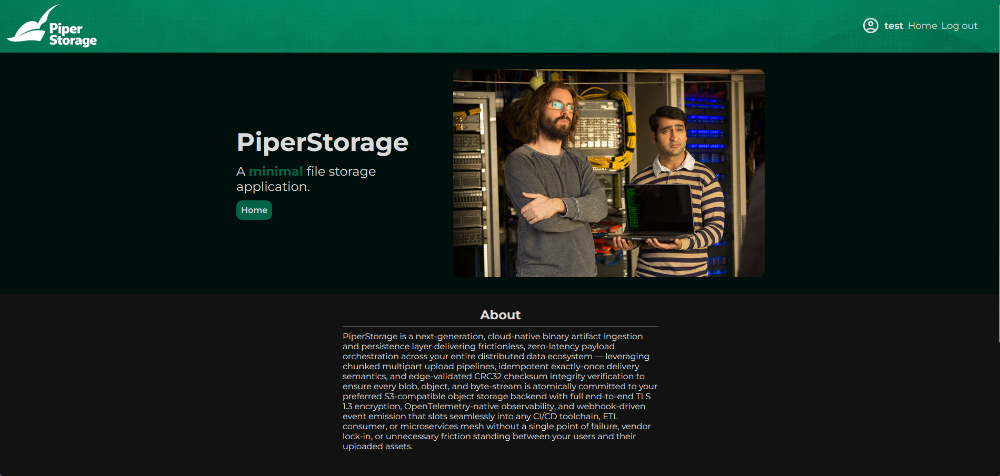
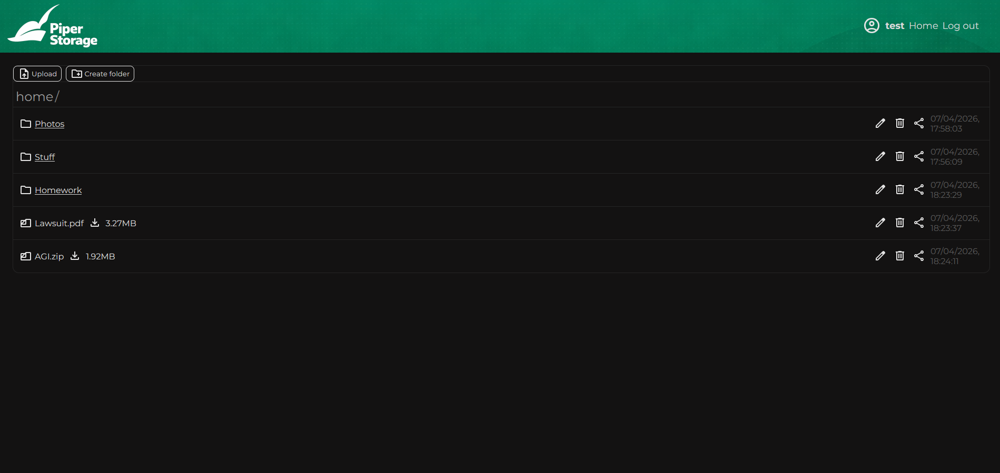
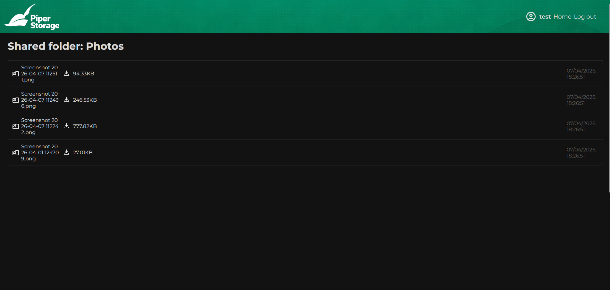

# Piper Storage

A minimal file uploading and sharing app made to learn about Prisma ORM and data modeling.
The project was made using the MVC pattern and features basic backend functionality like server side validation and session management with passport.js.
On the front end, the design was inspired by the TV show Silicon Valley Pied Piper middle-out lossless compression company, using it's colors to make a very minimal but responsive design.  

The point of this project was to learn how to model data in a Prisma ORM schema, the model features a recursive folder structure allowing easy mapping of nested files and folders.

[Live demo](https://piper-storage.onrender.com/)

### What I used:
- Express.js
- Prisma ORM
- PostgreSQL Neon instance
- Web server on Render
- EJS for the front end

### Screenshots

